<p align="center">
  <a href="https://lastping.dev">
    <picture>
      <source media="(prefers-color-scheme: dark)" srcset=".github/hero-dark.svg">
      <source media="(prefers-color-scheme: light)" srcset=".github/hero-light.svg">
      
    </picture>
  </a>
</p>

<p align="center">
  <a href="https://lastping.dev"></a>
  <a href="https://lastping.dev/mcp/"></a>
  <a href="https://app.lastping.dev/docs"></a>
  <a href="https://app.lastping.dev/status/lastping-self"></a>
</p>

<p align="center">
  <a href="https://github.com/tp322d/lastping-app/releases"></a>
  <a href="LICENSE"></a>
  <a href="go.mod"></a>
  <a href="https://registry.terraform.io/providers/lastping-dev/lastping/latest"></a>
  <a href="https://lastping.dev"></a>
</p>

Most monitoring watches a thing and tells you when it looks wrong. LastPing
waits for a thing to check in and tells you when it doesn't. That inversion is
the whole product: **a job that breaks can't send you an error, but it can fail
to send you anything** — and absence is the one signal a broken process can
still produce.

This repository holds the open-source pieces: the `lastping` CLI, which wraps
any command and reports its start, exit code and traces, and the MCP server,
which lets an AI agent set up and read its own monitoring. The hosted service
they talk to is at **[lastping.dev](https://lastping.dev)**, free for
individuals.

## Quick start

```sh
# 1. Install the CLI (macOS and Linux, amd64 and arm64)
curl -fsSL https://raw.githubusercontent.com/tp322d/lastping-app/main/install.sh | sh

# 2. Wrap a job: a start ping, your command untouched, then its exit code
lastping run --monitor <monitor-id> -- ./backup.sh
```

```text
# 3. Or give your AI assistant the hosted MCP server, and sign in
https://mcp.lastping.dev/mcp
```

Create the monitor, and get its id, at [app.lastping.dev](https://app.lastping.dev),
or let your assistant do it over MCP. Connect steps for each client are at
[lastping.dev/mcp/](https://lastping.dev/mcp/#connect).

## Install

```sh
curl -fsSL https://raw.githubusercontent.com/tp322d/lastping-app/main/install.sh | sh
```

No Go toolchain needed — that pulls a prebuilt binary for macOS and Linux, on
amd64 and arm64, and verifies its checksum. Windows builds are on the
[releases page](https://github.com/tp322d/lastping-app/releases).

If you do have Go:

```sh
go install github.com/tp322d/lastping-app/cmd/lastping@latest
```

## `lastping run` — reporting you can't forget

Put it in front of whatever you already run:

```sh
lastping run --monitor <monitor-id> -- python nightly_etl.py
lastping run --monitor <monitor-id> -- ./backup.sh
lastping run --monitor <monitor-id> -- claude
```

It sends a start ping, runs your command untouched, and reports the exit code
when it finishes — success on 0, failure on anything else, with the tail of
stderr attached so the alert says *why*.

Three properties worth knowing, because they are the difference between a
monitoring wrapper you can trust in production and one you remove after a bad
night:

- **Your exit code always propagates.** The wrapper exits with whatever your
  command exited with, so CI behaves exactly as it did before you added it.
- **A failed ping never touches your command.** If LastPing is unreachable, your
  job still runs, still writes its output, still exits normally.
- **Interactive stays interactive.** stdin and stdout are handed over as file
  descriptors, so wrapping a REPL or an agent session works.

Why a wrapper rather than an instruction? Because anything advisory decays. An
AI agent told to report on every task will stop doing it, and a cron line you
meant to add a `curl` to never gets it. A wrapper reports from the process
lifecycle, so nothing depends on anybody remembering.

### Traces

`lastping run` always configures your wrapped command's OpenTelemetry
exporter, in its environment only, so an auto-instrumented agent can export
its own trace spans with no code change:

- `OTEL_EXPORTER_OTLP_TRACES_ENDPOINT` — the header-free monitor-URL form
  (`<ping url>/v1/traces`) when `LASTPING_API_KEY` is not set, so a headerless
  exporter can still authenticate; the ping host's `/v1/traces` (the Bearer
  form) when it is set.
- `OTEL_RESOURCE_ATTRIBUTES` — `lastping.monitor_id=<id>,lastping.run_id=<rid>`
  appended to whatever you already set, so a trace's spans join the same run
  the surrounding pings report.
- `OTEL_EXPORTER_OTLP_HEADERS` — `Authorization=Bearer <your key>`, only when
  `LASTPING_API_KEY` is set and you have not already set that variable
  yourself.

Any of the three you already set is left alone. The key is never used to
authenticate a ping; the ping URL stays unauthenticated by design, as above.

## MCP server — let an agent set up its own monitoring

### Claude Desktop extension

A one-click install for Claude Desktop on macOS and Windows that keeps your
key in the system keychain. It needs no Node.js.

1. Download [lastping.mcpb](https://github.com/tp322d/lastping-app/releases/latest/download/lastping.mcpb).
2. Double-click it; Claude Desktop opens its install dialog.
3. Paste a write-scope key from Settings, API keys at
   [app.lastping.dev](https://app.lastping.dev).

The extension runs this repository's stdio binary (below) on your computer.
It is built by `mcpb/build.sh` when a version is tagged, and every release is
signed; the release build fails rather than ship an unsigned bundle. The
certificate is self-signed, so Claude Desktop shows the extension as
unverified. The signature still proves the bundle came from this repository's
release pipeline and was not altered after it was signed. A local build of
`mcpb/build.sh` without the signing secrets is unsigned and says so.
`MCPB_CERT_CA_ISSUED` is kept for a future certificate from a public CA.

### Claude Desktop through the mcp-remote bridge

Claude Desktop's config file runs local programs only, so LastPing connects
through the mcp-remote bridge. Add this to `claude_desktop_config.json`
(macOS: `~/Library/Application Support/Claude/`, Windows: `%APPDATA%\Claude\`):

```json
{
  "mcpServers": {
    "lastping": {
      "command": "/ABSOLUTE/PATH/TO/npx",
      "args": [
        "-y", "mcp-remote",
        "https://mcp.lastping.dev/mcp",
        "--header", "Authorization:${LASTPING_AUTH}"
      ],
      "env": {
        "PATH": "/FOLDER/THAT/HOLDS/npx:/usr/bin:/bin",
        "LASTPING_AUTH": "Bearer lp_your_key"
      }
    }
  }
}
```

- Needs Node.js. Claude Desktop does not read your shell's PATH, so give it
  the full path: run `which npx` in a terminal and put the result in
  `command` (with nvm it looks like
  `/Users/you/.nvm/versions/node/v22.11.0/bin/npx`), and its folder at the
  front of `PATH` in `env`.
- Quit and reopen Claude Desktop; it reads the file only at start-up.
  Settings, Connectors then lists lastping.
- Without a key, add LastPing as a custom connector instead (Customize,
  Connectors, Add custom connector, then paste `https://mcp.lastping.dev/mcp`)
  and sign in to LastPing in the browser. The same connector covers claude.ai,
  the Claude mobile apps and Cowork.

### Other clients

Claude Code connects directly, no bridge:
`claude mcp add --transport http --scope user lastping https://mcp.lastping.dev/mcp --header "Authorization: Bearer <key>"`.
Cursor, Windsurf, Codex CLI, Gemini CLI and other clients:
[lastping.dev/mcp/#connect](https://lastping.dev/mcp/#connect).

The hosted server is the recommended path, and it always carries the current
tool set. Most clients connect by adding the URL and signing in to LastPing,
with nothing to install; Cursor and Windsurf use the URL and an API key. With a
key, Claude Desktop connects through the extension or the mcp-remote bridge
above.

A stdio binary is also here if you would rather run it yourself:

```sh
go install github.com/tp322d/lastping-app/cmd/lastping-mcp@latest
```

<details>
<summary><b>Tools in this repository's stdio binary (50)</b></summary>

Monitors: `create_monitor` · `get_monitor` · `list_monitors` ·
`update_monitor` · `delete_monitor` · `pause_monitor` · `resume_monitor` ·
`snooze_monitor`

Discovery: `discover_monitors_reconcile`

Reporting: `get_ping_instructions` · `declare_run_expectations`

Incidents & runs: `list_incidents` · `get_run_history` · `get_run`
(one run's full timeline, assertion verdicts and spans) · `list_runs`
(runs across every monitor, traced runs included, with filters) ·
`get_incident` (one incident's recorded timeline)

Tracing: `get_trace_setup` (the set-up steps for one tool, from the server) ·
`create_ingest_key` (a tracing key bound to one monitor; a write key is
enough) · `get_trace_diagnostics` (why a sent span was refused)

Agent observability: `get_agent_dependencies` · `get_agent_usage` ·
`list_dependencies` · `list_discovered_agents` · `adopt_discovered_agent`

The failure loop: `list_open_incidents` · `add_incident_note`

Alert routing: `set_route` · `delete_route`

Delivery log: `list_deliveries`, recent alert deliveries across every
monitor, no paging

Destinations: `list_destinations` · `create_destination` ·
`update_destination` · `test_destination` · `delete_destination`

Alert templates: `get_alert_templates` · `set_alert_template`

Agent registry: `register_agent` · `list_agents` · `get_agent` ·
`update_agent` · `delete_agent`

Status pages: `list_status_pages` · `create_status_page` ·
`update_status_page` · `delete_status_page`

API keys: `create_api_key` (optional `scope`: read / write / admin / ingest) ·
`list_api_keys` · `regenerate_api_key` (new secret, same key; does not
cascade) · `revoke_api_key` (cascades to every key it created)

Terraform: `export_terraform`

This binary carries the same tool set as the hosted server at
`mcp.lastping.dev`. It is a thin REST client throughout: every tool is a
direct HTTP call to the management API, so it stays free to run yourself with
no lag behind the hosted surface beyond a new release.

</details>

The one that matters most is `get_ping_instructions`: an agent calls
`create_monitor`, then asks for its own ping commands, and wires them into its
own work — in one conversation, without a human opening a dashboard.

## Ping API

Every monitor gets a URL. There is nothing to install and no library to keep
current; anything that can make an HTTP request can report.

| What happened | Request |
|---|---|
| finished successfully | `POST <ping-url>` |
| started a run | `POST <ping-url>/start` |
| failed | `POST <ping-url>/fail` with the error as the body |
| exited with a code | `POST <ping-url>/<exit-code>` |
| waiting on a human | `POST <ping-url>/blocked` |
| progress worth recording | `POST <ping-url>/note` |

Add `?rid=<id>` to pair a run's start with its result, so LastPing can group a
run's pings and time it.

```sh
# The classic one-liner, at the end of a cron job:
curl -fsS -m 10 --retry 3 https://ping.lastping.dev/<monitor-id>
```

### Traces

`POST https://ping.lastping.dev/v1/traces` accepts an OTLP/HTTP export
(`application/x-protobuf` or `application/json`, gzip accepted) with a
`Bearer` key (an `ingest` key bound to the monitor, from `create_ingest_key`;
a write or admin key also works), or `POST <ping-url>/v1/traces` for exporters that
cannot set headers. Spans need the resource attribute `lastping.monitor_id`;
with `lastping.run_id` they join that run, and without it each trace becomes a
run of its own. A payload is capped at 1 MiB decompressed,
500 spans per request and 2,000 spans per run. `lastping run` sets all of
this up for you — see Traces above.

## Monitoring as code

```hcl
resource "lastping_monitor" "nightly_etl" {
  name          = "nightly-etl"
  slug          = "nightly-etl"
  schedule_kind = "cron"
  cron_expr     = "0 3 * * *"
  tz            = "Europe/Berlin"
  grace_s       = 900
}
```

The provider is on the
[Terraform Registry](https://registry.terraform.io/providers/lastping-dev/lastping/latest)
as `lastping-dev/lastping`, with source at
[lastping-dev/terraform-provider-lastping](https://github.com/lastping-dev/terraform-provider-lastping).

## Links

- **[lastping.dev](https://lastping.dev)** — the hosted service, free for individuals
- **[AI agent monitoring](https://lastping.dev/agents/)** — the agent-first guide
- **[MCP server](https://lastping.dev/mcp/)** — connect configs per client
- **[Terraform provider](https://lastping.dev/terraform)** — monitoring as code
- **[Integration guides](https://lastping.dev/monitor/)** — cron, Kubernetes, systemd, GitHub Actions, Python, Node

## License

MIT. See [LICENSE](LICENSE).
